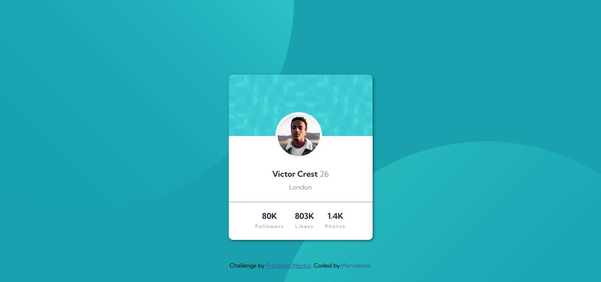

### Frontend Mentor - Profile card component solution

This is my solution to the Profile card component challenge on Frontend Mentor. Frontend Mentor challenges helps to improve my coding skills by building realistic projects.

------------

**The challenge**

Build out the project to the designs provided.

Built with
- Semantic HTML5 markup
- CSS custom properties
- Flexbox
- Mobile-first workflow

**Author**
Website Maria de los Angeles Hernandez

